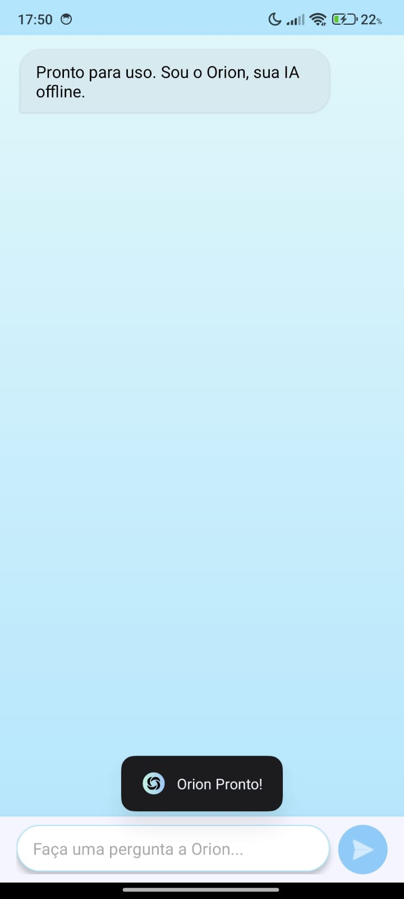
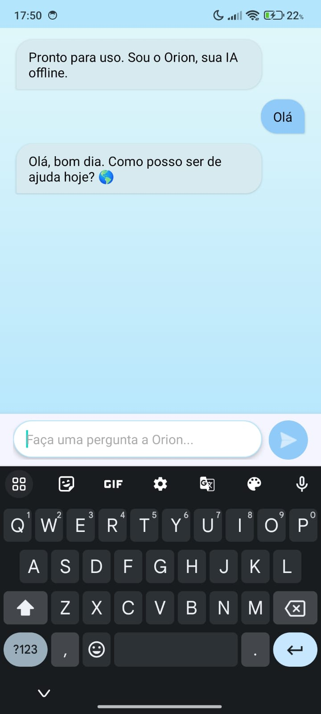
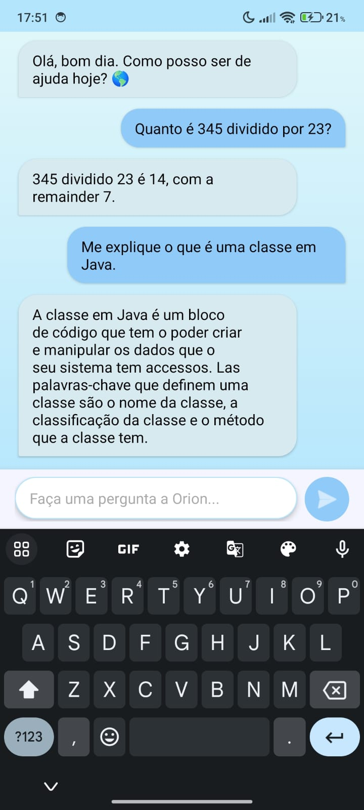

# Orion — IA Offline para Android

> 🇺🇸 [English version](README.md)

Orion é um assistente de inteligência artificial que roda **100% offline** no dispositivo Android. Utilizando o modelo de linguagem **Gemma** via **Google MediaPipe**, o app permite conversas com uma IA local, sem enviar nenhum dado para servidores externos. O acesso é protegido por **autenticação biométrica** (impressão digital ou PIN do dispositivo).

---

## Screenshots

> <p align="center">
  
  
  
</p>

---

## Funcionalidades

- **IA 100% offline** — o modelo Gemma roda diretamente no dispositivo, sem necessidade de internet
- **Chat com histórico persistente** — todas as conversas são salvas localmente em SQLite e carregadas ao reabrir o app
- **Autenticação biométrica** — acesso protegido por impressão digital, reconhecimento facial ou PIN do sistema
- **Interface de chat estilo bolha** — mensagens do usuário à direita (azul) e respostas da IA à esquerda (verde)
- **Respostas em Português do Brasil** — prompt engenheirado para forçar respostas em pt-BR usando as tags oficiais do Gemma
- **Carregamento assíncrono da IA** — o modelo é inicializado em thread separada para não travar a UI
- **Privacidade total** — nenhum dado sai do dispositivo

---

## Tecnologias Utilizadas

| Tecnologia | Versão | Descrição |
|---|---|---|
| **Java** | 11 | Linguagem principal do desenvolvimento |
| **Android SDK** | API 35 (Android 15) | SDK alvo de compilação |
| **Min SDK** | API 24 (Android 7.0) | Versão mínima suportada |
| **Google MediaPipe** | 0.10.29 | Framework de ML para rodar o modelo Gemma on-device |
| **Gemma (model.bin)** | — | Modelo de linguagem local embarcado como asset |
| **AndroidX Biometric** | 1.1.0 | Autenticação biométrica (digital, face, PIN) |
| **AndroidX AppCompat** | 1.7.1 | Compatibilidade de componentes entre versões |
| **Material Design** | 1.12.0 | Componentes visuais e design system do Google |
| **ConstraintLayout** | 2.2.1 | Sistema de layout para posicionamento flexível |
| **RecyclerView** | AndroidX | Listagem eficiente das mensagens do chat |
| **SQLite** | Nativo Android | Banco de dados local para histórico de conversas |
| **Gradle (Kotlin DSL)** | 8.8.0 (AGP) | Sistema de build e gerenciamento de dependências |

---

## Arquitetura e Estrutura do Projeto

```
Orion/
└── app/src/main/
    ├── java/com/example/project_orion/
    │   ├── LockActivity.java     # Tela de bloqueio com autenticação biométrica (launcher)
    │   ├── MainActivity.java     # Tela principal do chat, inicialização da IA e envio de mensagens
    │   ├── ChatAdapter.java      # Adapter do RecyclerView para renderizar as bolhas de chat
    │   ├── ChatDbHelper.java     # Camada de acesso ao SQLite para histórico de conversas
    │   └── Message.java          # Model da entidade mensagem (texto + remetente)
    ├── assets/
    │   └── model.bin             # Modelo Gemma compilado para inferência local
    └── res/
        ├── layout/
        │   ├── activity_main.xml # Layout do chat (RecyclerView + campo de input + botão)
        │   └── item_message.xml  # Layout de cada bolha de mensagem
        ├── drawable/
        │   ├── bubble_user.xml        # Bolha azul do usuário
        │   ├── bubble_ai.xml          # Bolha verde da IA
        │   ├── bg_chat_gradient.xml   # Fundo degradê do chat
        │   ├── bg_input_field.xml     # Estilo do campo de texto
        │   └── bg_send_button_circle.xml # Estilo do botão enviar
        └── values/               # Cores, strings e temas
```

---

## Como a IA Funciona

O Orion utiliza a biblioteca **MediaPipe Tasks GenAI** para carregar e executar o modelo **Gemma** diretamente na memória do dispositivo.

**Fluxo de inicialização:**

```
App inicia → LockActivity (biometria) → MainActivity
    → model.bin copiado de assets para armazenamento interno
    → LlmInference inicializado em Thread separada
    → Toast "Orion Pronto!" → Chat liberado
```

**Formato do prompt (Gemma instruct):**

```
<start_of_turn>user
Você é o Orion, um assistente útil e inteligente.
Responda à pergunta abaixo de forma resumida e sempre em Português do Brasil.

Pergunta: {mensagem do usuário}
<end_of_turn>
<start_of_turn>model
```

---

## Banco de Dados

O app usa **SQLite** para persistir o histórico de conversas entre sessões.

**Tabela `messages`**

| Coluna | Tipo | Descrição |
|---|---|---|
| `_id` | INTEGER PK | Identificador único (autoincrement) |
| `text` | TEXT | Conteúdo da mensagem |
| `is_user` | INTEGER | `1` = usuário, `0` = IA |

---

## Autenticação Biométrica

O app usa `androidx.biometric.BiometricPrompt` para exigir autenticação antes de conceder acesso ao chat. São aceitos:

- Impressão digital (Biometric Strong)
- Reconhecimento facial seguro
- PIN / Senha / Padrão do dispositivo (fallback)

Se a autenticação falhar ou for cancelada, o app é encerrado. Ao ser autenticado, o usuário é redirecionado para o chat e a `LockActivity` é finalizada (impedindo voltar para ela com o botão "Voltar").

---

## Como Executar

### Pré-requisitos

- Android Studio (Hedgehog ou superior)
- JDK 11+
- Dispositivo físico com Android 7.0+ (API 24) — **recomendado** por conta do processamento do modelo de IA
- O arquivo `model.bin` (modelo Gemma compilado) deve estar em `app/src/main/assets/`

> O modelo `model.bin` é grande (~1-4 GB dependendo da versão) e geralmente não é versionado no repositório. Faça o download separadamente e adicione à pasta `assets/`.

### Passos

1. Clone ou baixe o repositório
2. Adicione o `model.bin` em `app/src/main/assets/` * [Clique aqui para baixar o modelo do Google Drive](https://drive.google.com/file/d/1lE0LvfBxQGUIbLHSCnQJoCQ21SHE7BWM/view?usp=drive_link)
3. Abra o projeto no **Android Studio**
4. Aguarde a sincronização do Gradle
5. Conecte um dispositivo físico (emuladores não suportam biometria real nem têm GPU para inferência)
6. Clique em **Run ▶** ou use `Shift + F10`

---

## Dependências Principais

```kotlin
// IA on-device com MediaPipe
implementation("com.google.mediapipe:tasks-genai:0.10.29")

// Autenticação biométrica
implementation("androidx.biometric:biometric:1.1.0")

// UI
implementation(libs.appcompat)          // 1.7.1
implementation(libs.material)           // 1.12.0
implementation(libs.constraintlayout)   // 2.2.1
```

---

## Melhorias Futuras

- [ ] Suporte a streaming de resposta (tokens em tempo real)
- [ ] Seleção de diferentes modelos de IA
- [ ] Limpeza do histórico de conversas
- [ ] Múltiplas sessões de chat
- [ ] Exportação do histórico
- [ ] Modo escuro dedicado
- [ ] Suporte a voz (input por microfone)

---

## Observações

- O modelo Gemma consome recursos significativos de RAM e GPU. Recomenda-se dispositivos com pelo menos **6 GB de RAM**.
- A primeira execução pode ser lenta pois o `model.bin` é copiado dos assets para o armazenamento interno do app.
- O app não coleta nem transmite nenhum dado — toda inferência é local.

---

## Autor

Desenvolvido como projeto de portfólio Android com foco em IA on-device e privacidade.

---

## Licença

Este projeto está sob a licença MIT.
